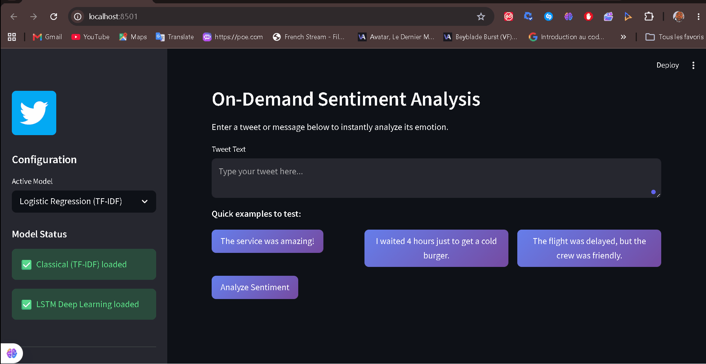

# BrandPulse AI 🚀

<div align="center">
  
  <p><em>Replace <code>preview.gif</code> with your actual screenshot or GIF. / Remplacez <code>preview.gif</code> par votre vraie capture d'écran ou GIF.</em></p>
  
  <br />
      
</div>

---

<details open>
  <summary><b>Table of Contents / Table des matières</b></summary>
  <ul>
    <li><a href="#-english">🇬🇧 English</a></li>
    <ul>
      <li><a href="#-about-the-project">About the Project</a></li>
      <li><a href="#-key-features">Key Features</a></li>
      <li><a href="#-getting-started">Getting Started</a></li>
    </ul>
    <li><a href="#-français">🇫🇷 Français</a></li>
    <ul>
      <li><a href="#-à-propos-du-projet">À propos du projet</a></li>
      <li><a href="#-fonctionnalités-clés">Fonctionnalités clés</a></li>
      <li><a href="#-démarrage-rapide">Démarrage rapide</a></li>
    </ul>
  </ul>
</details>

---

## 🇬🇧 English

### 📖 About the Project
An intelligent Sentiment Analysis platform classifying Twitter data into Positive, Neutral, or Negative using TF-IDF and Bi-Directional LSTM.

### ✨ Key Features
- 📊 Real-time sentiment classification
- 🧠 Bi-Directional LSTM model
- 📈 Interactive Streamlit dashboard
- 🧹 Automated data preprocessing

### 💻 Getting Started
To get a local copy up and running, execute the following commands:
```bash
python -m venv venv
venv\Scripts\activate
pip install -r requirements.txt
streamlit run app.py
```

---

## 🇫🇷 Français

### 📖 À propos du projet
Une plateforme intelligente d'analyse de sentiments classifiant les données Twitter en Positif, Neutre ou Négatif via TF-IDF et LSTM bidirectionnel.

### ✨ Fonctionnalités clés
- 📊 Classification des sentiments en temps réel
- 🧠 Modèle LSTM bi-directionnel
- 📈 Tableau de bord interactif Streamlit
- 🧹 Prétraitement automatisé des données

### 💻 Démarrage rapide
Pour installer et lancer ce projet localement, exécutez ces commandes :
```bash
python -m venv venv
venv\Scripts\activate
pip install -r requirements.txt
streamlit run app.py
```

---
<div align="center">
  <sub>Built with ❤️ by Ricardo | AI & Full-Stack Developer</sub>
</div>
