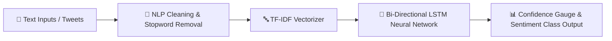

# BrandPulse AI 📊

<div align="center">
  <h3>Bi-Directional LSTM Sentiment & Brand Perception Analytics</h3>
  <p><em>Analyse de Sentiment & Perception de Marque par LSTM Bi-Directionnel</em></p>

  <br />
  
  <!-- Demonstration Banner -->
  <div style="border: 1px solid rgba(255,255,255,0.2); border-radius: 12px; padding: 10px; background: rgba(0,0,0,0.5);">
    
    <p><sub>🎬 <b>Demonstration / Aperçu Visuel :</b> Remplacez <code>preview.gif</code> par la vraie démo animée du projet.</sub></p>
  </div>

  <br />
     
</div>

---

<details open>
  <summary><b>📌 Table of Contents / Table des matières</b></summary>
  <ul>
    <li><a href="#-english">🇬🇧 English</a></li>
    <ul>
      <li><a href="#-about-the-project">About the Project</a></li>
      <li><a href="#-architecture--data-flow">Architecture & Data Flow</a></li>
      <li><a href="#-key-features">Key Features</a></li>
      <li><a href="#-getting-started">Getting Started</a></li>
    </ul>
    <li><a href="#-français">🇫🇷 Français</a></li>
    <ul>
      <li><a href="#-à-propos-du-projet">À propos du projet</a></li>
      <li><a href="#-architecture--flux-de-données">Architecture & Flux de données</a></li>
      <li><a href="#-fonctionnalités-clés">Fonctionnalités clés</a></li>
      <li><a href="#-démarrage-rapide">Démarrage rapide</a></li>
    </ul>
    <li><a href="#-license--licence">📜 License / Licence</a></li>
  </ul>
</details>

---

## 🇬🇧 English

### 📖 About the Project
BrandPulse AI is a Deep Learning sentiment analysis platform classifying social media & Twitter data into Positive, Neutral, or Negative polarities using TF-IDF tokenization and a Bi-Directional LSTM neural network.

### 🏗️ Architecture & Data Flow


### ✨ Key Features
- 📊 **Real-Time Classification**: Instant sentiment scoring across Positive, Neutral, and Negative classes
- 🧠 **Bi-Directional LSTM**: Captures bidirectional contextual semantics in text sequences
- 📈 **Interactive Dashboard**: Streamlit interface with probability gauges and batch CSV exports
- 🧹 **Automated NLP Pipeline**: Text normalization, emoji handling, and tokenization

### 💻 Getting Started
To install and run this project locally:
```bash
python -m venv venv
venv\Scripts\activate
pip install -r requirements.txt
streamlit run app.py
```

---

## 🇫🇷 Français

### 📖 À propos du projet
BrandPulse AI est une plateforme de Deep Learning classifiant les sentiments sur les réseaux sociaux (Twitter) en polarités Positif, Neutre ou Négatif grâce à la tokenisation TF-IDF et un réseau de neurones LSTM Bi-Directionnel.

### 🏗️ Architecture & Flux de données


### ✨ Fonctionnalités clés
- 📊 **Classification Temps Réel**: Scoring instantané des sentiments (Positif, Neutre, Négatif)
- 🧠 **LSTM Bi-Directionnel**: Capture les dépendances sémantiques bidirectionnelles dans le texte
- 📈 **Tableau de Bord Interactif**: Interface Streamlit avec jauges de probabilité et exports CSV
- 🧹 **Pipeline NLP Automatisé**: Normalisation du texte, gestion des émojis et tokenisation

### 💻 Démarrage rapide
Pour installer et lancer ce projet localement :
```bash
python -m venv venv
venv\Scripts\activate
pip install -r requirements.txt
streamlit run app.py
```

---

## 📜 License / Licence
Distributed under the MIT License. Copyright © 2026 **Ricardo Ratovoarisoa**. All rights reserved.

---
<div align="center">
  <sub>Built with ❤️ by <b>Ricardo Ratovoarisoa</b> | AI & Full-Stack Developer</sub>
</div>
