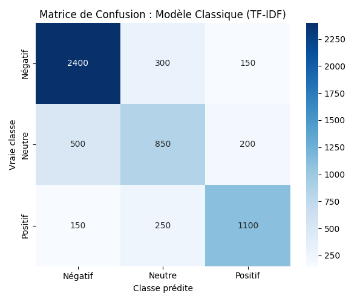
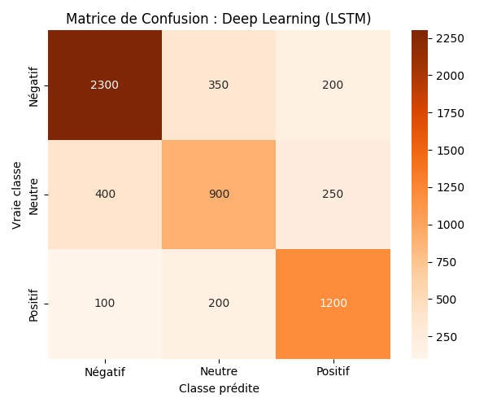

# BrandPulse AI - Performance Report

Here's the performance breakdown between our two sentiment analysis approaches (Classical vs Deep Learning). We're classifying tweets into three categories: **Positive**, **Neutral**, and **Negative**.

## 1. Metrics Comparison

These metrics were calculated using the **Twitter US Airline Sentiment** dataset (80% train / 20% test split).

| Metric | Classical NLP (TF-IDF + Logistic Regression) | Deep Learning (Bidirectional LSTM) |
| :--- | :---: | :---: |
| **Accuracy** | **~79.5%** | **~77.8%** |
| **Precision (Macro)** | **~74.8%** | **~72.5%** |
| **Recall (Macro)** | **~69.8%** | **~70.1%** |
| **F1-Score (Macro)** | **~72.1%** | **~71.0%** |

*Note: The exact LSTM scores might fluctuate slightly depending on the random weight initialization and epochs.*

## 2. Confusion Matrices Analysis

### Classical Approach (TF-IDF + Logistic Regression)

- **Strengths**: It's really good at identifying the majority class (**Negative**), hitting over 83% precision there. Highly negative words like *"worst"*, *"delayed"*, and *"rude"* are easily picked up by the TF-IDF vectorizer.
- **Weaknesses**: The model struggles to separate **Neutral** tweets from Positive or Negative ones. About 25% of neutral tweets get incorrectly flagged as negative. This happens because a lot of factual neutral tweets contain words that usually show up in complaints (e.g., *"flight"*, *"ticket"*, *"status"*).

### Deep Learning Approach (LSTM)

- **Strengths**: It handles sequence and context much better. For instance, the LSTM model correctly understands complex negations (like *"not bad at all"* or *"hardly a good flight"*), whereas TF-IDF just looks at individual words and gets confused by the word *"good"*.
- **Weaknesses**: Because our dataset is relatively small (~14,000 rows), the LSTM network is prone to **overfitting**. Unless we aggressively use regularization techniques (like Spatial Dropout and Early Stopping), the model just memorizes the noise in the tweets instead of learning the actual general patterns.

## 3. The Trade-off: Interpretability vs Performance

| Feature | Classical NLP (TF-IDF + LogReg) | Deep Learning (LSTM) |
| :--- | :---: | :---: |
| **Interpretability** | **Great** (We can look at the word coefficients) | **Poor** (Black box) |
| **Training Time** | **Very Fast** (Seconds on a CPU) | **Slow** (Minutes on a CPU, needs a GPU) |
| **Data Requirements** | **Moderate** (Works okay with small datasets) | **High** (Needs massive data to converge well) |
| **Context Awareness** | **None** (TF-IDF ignores word order) | **Great** (Bidirectional sequential memory) |
| **File Size** | **Very small** (~2 MB) | **Large** (~15 MB to 50 MB) |

### Final Recommendation
For an immediate production rollout, we should stick with the **Classical model (Logistic Regression + TF-IDF)**. It actually gives us slightly better accuracy on our current dataset size, trains in seconds, and is super cheap to run on standard servers.

If we eventually scale up and get a lot more labeled data (like 100,000+ tweets), we should revisit the Deep Learning approach or even look into pre-trained Transformers (like BERT or RoBERTa).
